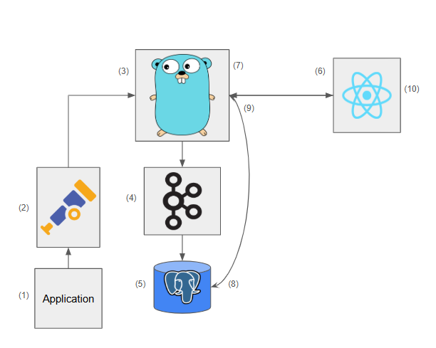

# ServiLens

ServiLens is the backend to the tool ServiGraph. ServiLens is a tool to help you visualize and understand your microservices architecture.
It provides a set of APIs to collect, analyze, and visualize data about your microservices. 

## Getting Started
You need to add the following configuration in the OpenTelemetry collector configuration of your application:
```yaml
receivers:
  otlp:
    protocols:
      grpc:
        endpoint: localhost:4317
      http:
        endpoint: localhost:4318
exporters:
    otlp:
        endpoint: tracer:5678
        tls:
            insecure: true
service:
  pipelines:
    traces:
      receivers: [otlp]
      exporters: [otlp]
```
This is with the assumption that your application and ServiGraph are both running on the same network.

After setting up your application, you can run the ServiLens server using the following command:
```bash
docker-compose up --build
```

## API
We provide a set of APIs to collect, analyze, and visualize data about your microservices. The APIs are as follows:
- `GET /v1/fetchTraceData`: This API endpoint is used by the UI application to fetch the trace data from the backend. It takes in a `from_timestamp_in_unix` argument as parameter. This returns all the trace data generated by your application after the given timestamp.

## Architecture
Here is an architecture diagram of the ServiLens backend: <br>
<br>
- The application gets traffic from its users and generates corresponding telemetry data
- The telemetry data (trace and metric data) is then pushed to the OpenTelemetry collector for batching and processing.
- OpenTelemetry pushes the data to the backend of our tool, acting as an exporter sink. The backend listens on a GRPC port on which the data is transmitted using OpenTelemetry Protocol encoding.
- The backend hook pushed the data to a Kafka queue for asynchronous processing. This keeps the interface lightweight and nonblocking, pushing the I/O operations to an asynchronous thread.
- The kafka consumer reads the data from the queue as it arrives, models it based on a defined schema, and pushes it to a PostgreSQL database for querying and persistence.
- The consumer of our application interacts with the React based UI to look at the metrics and visualisation for their deployed application. Any request for viewing data triggers a FetchData API call to our backend tool through a GRPC HTTP gateway.
- The backend performs a query on the database based on the request to fetch the data for the consumer.
- The database runs the query, filters it on the basis of the request, batches data over a given time range, and returns it back to the backend.
- The backend encodes the data and pushes the data back to the frontend in the form of a JSON blob.
- The frontend parses the data and shows the visualisation and metrics on the frontend as per requirements.

## Testing
To run the tests with coverage, you can use the following command:
```bash
make test
```
To run the tests without coverage, you can use the following command:
```bash
make test-basic
```

## License
This project is licensed under the Apache License 2.0 - see the [LICENSE](LICENSE) file for details.

## Contributing
We welcome contributions to this project. Please read our [CONTRIBUTING](CONTRIBUTING.md) file for more information on how to contribute.